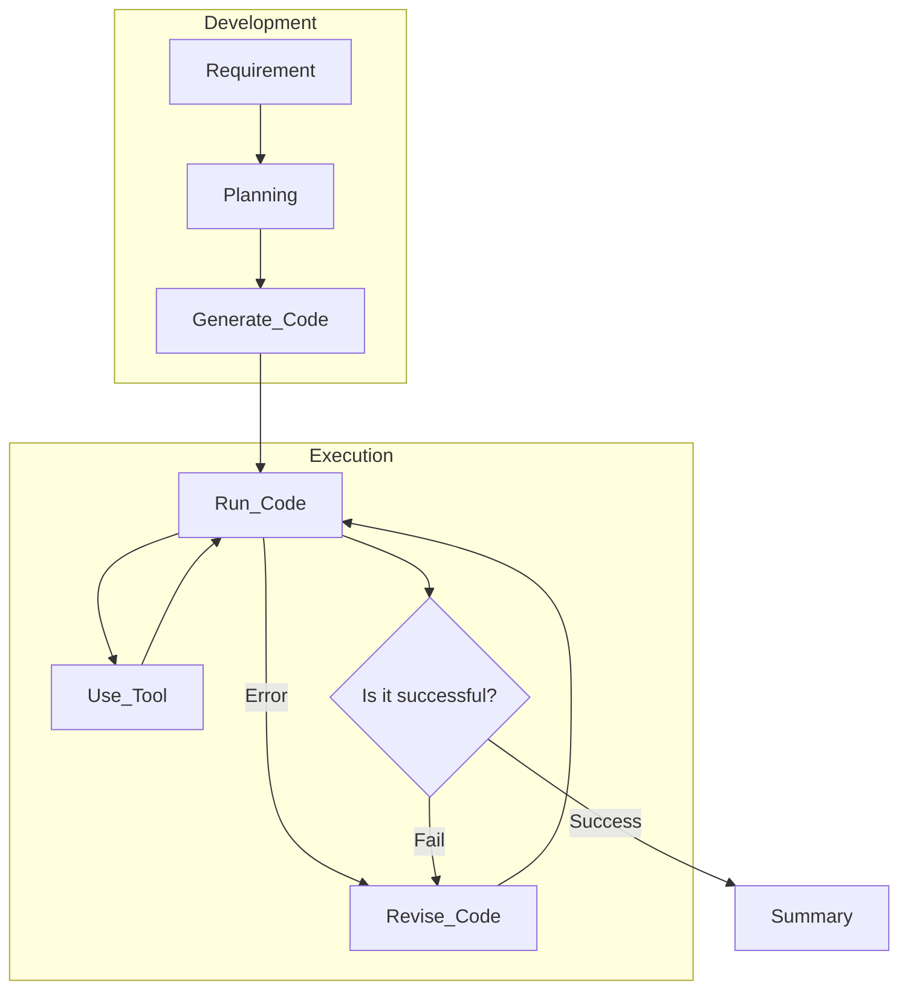

# watsonx-agentic
agentic demo base on watsonx.ai

Agentic is a hot topic to explore on LLM.
here a demo that show case how to do agentic with watsonx.ai

## agentic:

1) for most task, LLM not likely be able to complete it by itself.
2) it is about how to handoff the task to other tools that excel on particular task.
3) it is about how to use tool.
4) it is about how to orchestrate with other agent or tool.
5) it is about how to do planning.
6) it is about how to evaluate the result.
7) it is about how to consolidate the result.

## a few principles:

1) trust on code and tool over the memory.
2) you can use the tool provided, likely be well tested and reliable.
3) you can also ask the model to generate the code on the spot, but you need more turn to help debug and revise the code.

## steps:

### 1) Planning

generate more detail of the step in natural language base on requirement. that make the following generation steps more clear.

### 2) Generate Code

generate python code that base on the requirement along with planning. hence help to give the code to run.

### 3) Run Code

run the code and capture the stdout and stderr. if got error, then try revise base on the error.

### 4) Use Tool

propose a few proven tools for use, typically the tool help to get new knowledge not available in the model. and also help to do calculation type of work, that the model not excel on.

### 5) Revise the Code

base on the code, and error capture, help to revise the code to run in next turn.

### 6) Summary

summarize the result collect to a tone and level of detail helpful to user.

test cases:

1) 9.11 bigger than 9.8

it show case LLM not good on math, so it is not a reliable approach on math question.

2) how many R in straberry.

it show case LLM not good on counting.

3) how many prime number within 10000.

you cant ride on LLM to do this kind of math works.

4) when is the time now.

it show case LLM not have the latest information of the world, so it need to employ other tools to get those information.

5) how is the weather today.

it show case LLM not have the latest information of the world, so it need to employ other tools to get those information.